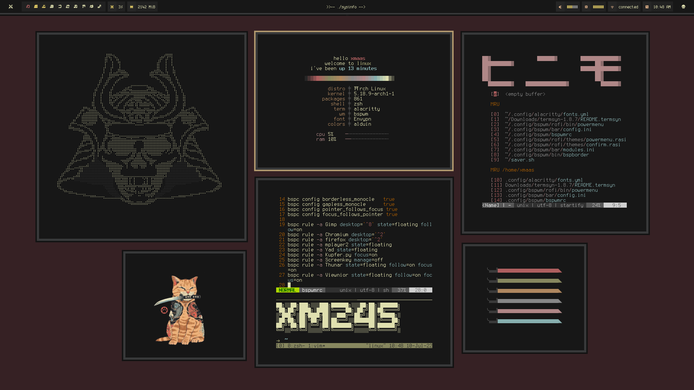

<h2 align="center"> 𝖗𝖔𝖓𝖎𝖓 </h2>

<h2 align="center"> ━━━━━━  ❖  ━━━━━━ </h2>

## <samp>📜 INFORMATION</samp>

- **Operating System:** [EndeavourOS](https://endeavouros.com/)
- **Window Manager:** [bspwm](https://github.com/baskerville/bspwm)
- **Terminal:** [alacritty](https://github.com/alacritty/alacritty)
- **Shell:** [zsh](https://www.zsh.org/)
- **Bar:** [polybar](https://github.com/polybar/polybar)
- **Compositor:** [picom](https://github.com/yshui/picom)
- **Launcher:** [rofi](https://github.com/davatorium/rofi)

## <samp>🪶 FONTS</samp>
- **Main Font:** [Terminus](http://terminus-font.sourceforge.net/)
- **Bar Icons:** [Waffle](https://github.com/addy-dclxvi/bitmap-font-collections)
- **Japanese Font:** [Sunplaza](https://www.fontspace.com/sunplaza-font-f4767)

## <samp>⭐ INSPIRATIONS & CREDITS</samp>
- Theme was hugely inspired by Barbaross93's [Muspelheim Rice](https://github.com/Barbaross93/Muspelheim) and Pyratebeard's [port_royal Rice](https://www.reddit.com/r/unixporn/comments/ifmvrk/2bwm_port_royal/)
- Rofi configs was taken from [archcraft os](https://archcraft.io/flavors.html)
- Polybar modules was taken from [adi1090x](https://github.com/adi1090x/polybar-themes)
- Cat photo was taken from [Pinterest](https://www.pinterest.ph/pin/673710425520243360/)
